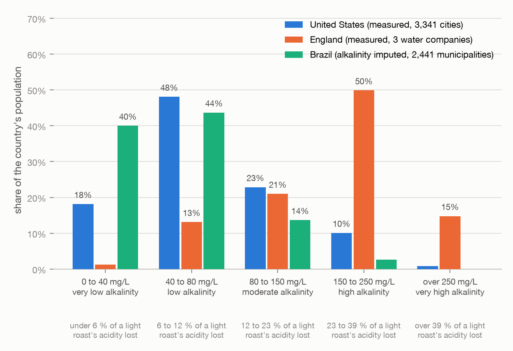
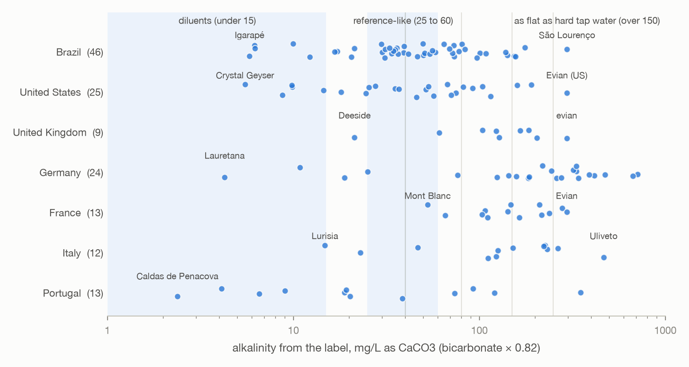

## Introduction

Municipal tap water varies widely in hardness (calcium and magnesium), alkalinity (mostly bicarbonate) and pH. Published chemistry describes how these variables affect coffee extraction and flavour. Bicarbonate neutralises the organic and chlorogenic acids that give coffee its perceived acidity [@Yeager2023]; dissolved cations may change the extraction of some compounds [@Hendon2014; @Bratthall2024]. These two bodies of knowledge have not been combined at scale: a map of the water people brew with, the chemistry applied to it, and a statement for each place and roast level of what the water does to the cup and how a brewer can compensate.

This study reports model predictions, not new sensory measurements. The predictions are stated in a form that can be tested, and Section 6 describes the test.

We address three questions.

1. How are alkalinity and hardness distributed in tap water when weighted by the population served, and can alkalinity be predicted where only hardness is reported?
2. What share of a coffee's acidity does a given water neutralise, by roast level, and for what share of the population is this share large?
3. What does compensation cost, in coffee dose, in bitterness, or in blended water?

## Data

### Sources

@tbl-sources lists the sources in the first version of the atlas. Each row of the underlying measurement table records the source file, its checksum, the download date, the licence, the original parameter name, value and unit, and the conversion factor applied.



**Brazil.** The national drinking-water surveillance system SISAGUA publishes the semestral control samples that suppliers report [@SISAGUA]. Total hardness, sodium and pH are present; alkalinity, calcium and magnesium are not measured in the system. We loaded the files for 2023 to 2026 (8.2 million rows) and kept 194,226 measurements of the three variables at treatment outlets, distribution systems and consumption points in 2,441 municipalities. Source type (surface or ground) comes from the intake registry.

**United States.** TapWaterData compiles utility-reported hardness for 16,561 cities from Consumer Confidence Reports, with a tier flag that separates utility-measured values from county-level ambient estimates [@TapWaterData2026]; we use the measured tiers only (7,614 cities). The EPA Six-Year Review 4 compliance data give finished-water alkalinity and pH per public water system for 2012 to 2019 [@EPASYR4]. Joining the two datasets on the utility identifier gives hardness and alkalinity for 3,341 cities served by 1,670 utilities. The Water Quality Portal was examined and not used: its 1.3 million recent results are ambient surface water and groundwater, with fewer than a dozen finished-water sites.

**England and Northern Ireland.** The water industry's open-data portal publishes tap-sample results per small area (Lower-layer Super Output Area, about 1,500 residents) for every company in England and Wales [@Stream]. Three companies report the variables needed here: Wessex Water (alkalinity and hardness, with units), Southern Water (calcium, magnesium and alkalinity, with an empty units column) and Yorkshire Water (hardness). Northern Ireland Water publishes hardness, calcium, magnesium, sodium and pH per supply zone under the Open Government Licence. The other companies publish alkalinity only in per-postcode lookups whose terms of use reserve all rights; those values were not used.

**Bottled water.** We compiled the label compositions of 187 bottled waters sold in supermarkets in Brazil, the United States, the United Kingdom, Germany, France, Italy and Portugal from brand websites and official label images, with one source URL per product; 182 have an official source. Alkalinity was computed as bicarbonate multiplied by 0.820 where bicarbonate is printed.

### Units and reporting basis

Hardness and alkalinity are stored in mg/L as CaCO~3~, ions in mg/L of the ion, with conversion factors derived from molar masses. Three sources report "total hardness" in mg/L where the figure is in fact mg/L as calcium, a factor of 2.5 lower than mg/L as CaCO~3~: Northern Ireland Water (the CaCO~3~ column of the zone report equals the CSV figure multiplied by 2.4985), Southern Water (the hardness column equals the calcium column, and the company's online checker labels its default unit "Cal mg/l") and SES Water. Wherever calcium and magnesium are both reported, hardness is derived from them and the reported hardness column is not used. Every value whose unit basis had to be assumed is flagged.

### Population weighting

A count of localities overstates the alkalinity of the water most people receive, because many small groundwater systems each count once. We attached a population to every locality: people served for United States utilities, mid-2024 estimates for English small areas, and the 2022 census for Brazilian municipalities. The per-locality median alkalinity of finished water in the United States and England is 187 mg/L; the population-weighted median is 83 mg/L. All results below are population-weighted unless stated otherwise.

### Alkalinity imputation

Brazil has no alkalinity data. Across 5,658 United States and English localities with both variables, a regression of log alkalinity on log hardness and source type has R^2^ 0.48 and a residual standard deviation of 0.52 on the log scale, which corresponds to a multiplicative uncertainty of 1.7 in either direction. We applied this regression to Brazil's 2,441 municipalities and flagged every imputed value. Headline statistics are reported with and without Brazil.

## Model

### Residual acidity

Coffee acids protonate the bicarbonate in brewing water. At brew pH 4.9 to 5.1, 94 to 96 percent of bicarbonate is protonated (carbonic acid pK~a1~ 6.35), so the neutralisation is close to one milliequivalent of acid per milliequivalent of alkalinity. We define the residual acidity of a brew in meq/L as

$$
\mathrm{residual} = \mathrm{TA}_\mathrm{intrinsic}(\mathrm{roast}, \mathrm{TDS}) - f(\mathrm{pH}) \cdot \frac{\mathrm{alkalinity}}{50.04},
$$

where TA is the titratable acidity to pH 8.2, alkalinity is in mg/L as CaCO~3~, and $f$ is the protonated fraction of bicarbonate at the brew pH. The neutralised share is the second term divided by the first.

### Parameters

Titratable acidity by roast level is taken from the one drip-coffee study that measured it across brew strength and extraction yield [@Batali2021]: 258 brews of one washed Honduran Arabica at three roast levels, three strengths (1.0, 1.25 and 1.5 percent total dissolved solids) and three extraction yields (16, 20 and 24 percent). Titratable acidity is linear in strength and nearly independent of extraction yield. @tbl-params gives the values. The brew water in that study contained 32 mg/L alkalinity as CaCO~3~ (computed from the printed mineral recipe), so the measured acidity had already lost about 0.6 meq/L to bicarbonate; the model adds this amount back before subtracting the alkalinity of the target water.



### Cation-dependent extraction

Hendon and colleagues predicted from binding energies that magnesium and calcium increase the extraction of coffee acids [@Hendon2014]. A GC-MS and NMR study found no such effect on organic acids at 100 mg/L [@Bratthall2024]. A three-water filter-brewing study found that dark roast brewed in the hardest water was rated more acidic by a recognition panel, which the authors attribute to calcium-assisted extraction [@Liu2025]. None of these studies gives a magnitude that can be used as a parameter. We include a multiplicative extraction term on titratable acidity with a central value of zero and an upper bound of a 5 percent yield increase per meq/L of divalent cations, and report results for both. The result of Liu and colleagues suggests that the upper bound is relevant for dark roasts.

### Alkalinity bands and matching criterion

We classify water into five alkalinity bands with edges at 40, 80, 150 and 250 mg/L as CaCO~3~. A Gaussian-mixture clustering was also fitted; it did not identify separated clusters. Tap water forms a continuum along the alkalinity–hardness line, and the information criterion continued to decrease up to the six-component limit. Fixed bands are equally defensible and simpler to communicate.

For each band and roast we compute the residual acidity at the band's population-weighted median water relative to the Specialty Coffee Association reference water (40 mg/L alkalinity, 68 mg/L hardness [@SCAwater]). A ratio of 0.75 to 1.25 is classified as *works*, 0.5 to 0.75 as *compensate*, and below 0.5 as *fights*.

### Sensory model and compensation rules

The trained-panel study from which the titratable acidity values come also reports marginal mean intensities of 32 attributes at each level of roast, strength and extraction [@Frost2020]. The design is balanced, so an additive model reproduces the marginal means exactly. Interaction terms are not published, and the same group's response surface for sourness is a first-order plane [@Batali2021], so main effects only are used. Sourness increases by 21 points per percentage point of strength and decreases by 0.83 points per percentage point of extraction; bitterness increases by 23 points per percentage point of strength.

Two calibrations connect water chemistry to perception. The roast means of Batali and colleagues give 3.61 sourness points per meq/L of titratable acidity. Dividing the acid neutralised by a water by the slope of titratable acidity against strength gives the strength increase that restores the acid balance (the chemistry estimate). Dividing the predicted sourness loss by the slope of sourness against strength gives the increase that restores the predicted sourness (the sensory estimate). The two estimates differ by a factor of 1.8, and both are reported. A third route is dilution: alkalinity is linear in mixing, so a volume fraction $1 - 40/\mathrm{alk}$ of zero-alkalinity water brings a tap water of alkalinity alk to the reference value.

## Results

### Distribution of tap-water alkalinity and hardness

@fig-where shows the 13,933 localities with both variables. Alkalinity and hardness are correlated along one line in every country. England's chalk catchments occupy the upper end; the imputed Brazilian municipalities form straight lines by construction. A small group of softened waters, with alkalinity retained and hardness removed, lies above the line and covers about 1 percent of the population.

{#fig-where}

### Neutralised share of coffee acidity

@fig-neutral shows the model output. At the reference alkalinity of 40 mg/L the water neutralises 6 percent of a light roast's titratable acidity and 8 percent of a dark roast's. At the population-weighted median for the United States (83 mg/L) the shares are 13 and 16 percent; at the population-weighted upper quartile (136 mg/L) they are 21 and 26 percent. For 20 percent of the population the water neutralises more than a quarter of a light roast's acidity, and for 31 percent more than a quarter of a dark roast's. The dark roast loses the largest share at every alkalinity because it has the lowest titratable acidity.

{#fig-neutral}

### Population by alkalinity band

@tbl-bands and @fig-bands give the distribution by band. Bands one to three (up to 150 mg/L) hold about 90 percent of the population; the reference alkalinity lies at the upper edge of the first band. Bands four and five (above 150 mg/L) hold about 10 percent of the population overall, but half of the English population served by the three companies with data, all of which draw on chalk aquifers.



{#fig-bands}

### Matching table

@tbl-matching applies the classification criterion. All roast levels are classified as *works* in bands one to three, at the band medians and at the band edges. All roast levels are classified as *compensate* in bands four and five: in band four the ratio ranges from 0.73 for light roast to 0.66 for dark roast, in band five from 0.62 to 0.53. Differences between roast levels within a band are smaller than differences between bands.



### Compensation rules

@fig-rules and @tbl-rules translate the model into recipe changes. Each 50 mg/L of alkalinity above the reference neutralises about 1 meq/L of acid and lowers predicted sourness by 3.6 points. Up to about 100 mg/L this can be offset by 5 to 10 percent more coffee per 40 mg/L above the reference, at a cost of 1 to 2 bitterness points. At 150 mg/L the strength route requires 16 to 29 percent more coffee and adds 4.5 bitterness points; at 250 mg/L, 31 to 55 percent and 8.5 points. Restoring sourness by lowering extraction alone would require a reduction of 9 percentage points in yield at 150 mg/L, whereas a change of grind size typically moves yield by 2 to 4 points, so extraction is insufficient on its own. Above 150 mg/L, dilution with zero-alkalinity water (73 percent at 150 mg/L, 84 percent at 250 mg/L) or the use of a low-alkalinity bottled water requires less change than any recipe adjustment.



{#fig-rules}

### Bottled water

@fig-bottled and @tbl-bottled place 142 bottled waters with a printed bicarbonate or alkalinity on the same scale. They cover the full range of tap water. Seventeen products have alkalinity below 15 mg/L and are suitable as diluents; most are purified United States brands. Thirty-two products have alkalinity between 25 and 60 mg/L and brew like the reference water; because a given product is the same everywhere, these are suitable as a control water for a validation study. Forty-two products, many of them European natural mineral waters, have alkalinity above 150 mg/L.



{#fig-bottled}

## Discussion

### The alkalinity–hardness relationship

The single line in @fig-where has a geochemical explanation. Where groundwater or surface water dissolves calcite or dolomite, each calcium or magnesium ion enters with two bicarbonate ions, so carbonate hardness and alkalinity are equal when both are expressed as CaCO~3~. Waters lie above the line when alkalinity comes with sodium rather than calcium (sodium bicarbonate groundwaters, and municipal softening, which exchanges calcium for sodium and leaves bicarbonate in place) and below it when hardness comes from gypsum or chloride salts rather than carbonate. The fitted slope of log alkalinity on log hardness is 0.62 rather than 1, which indicates that non-carbonate hardness makes up a growing share of hardness at the hard end of the distribution. For brewing this matters in two ways. First, hardness, which nearly every utility reports, is a usable proxy for alkalinity, with the factor-of-1.7 uncertainty stated above; the residual is the price of not measuring. Second, the two variables act on coffee by different mechanisms, buffering and extraction, and a water that departs from the line separates them: softened water has the buffering effect without the cations, and gypsum-rich water the reverse. These off-line waters are where the two mechanisms could be distinguished experimentally.

### The reference target and the population

The Specialty Coffee Association target of about 40 mg/L alkalinity [@SCAwater] lies at the upper edge of the first band, below the population-weighted median of 83 mg/L for the United States and below the water of about 80 percent of the population in our data. The target is a laboratory reference, not a description of tap water, and the model gives one reading of what it represents: a water that neutralises about 6 percent of a light roast's acidity, small enough to leave the roast's character intact. Half of the United States population is between 40 and 80 mg/L, where the neutralised share is 6 to 12 percent and the predicted sourness change relative to the reference is under 3 points on a 100-point scale, close to the resolution of a trained panel. The predicted effect becomes large only above 150 mg/L, for about 10 percent of the population in our data and half of the English population served by the three companies with data. The practical conclusion is that for most people the tap water is not far from the reference, and for a minority it is far enough that no recipe adjustment recovers the difference at acceptable cost.

### Lower sourness is not lower quality

The model predicts the direction and size of a sourness change. Whether the change is an improvement depends on who is drinking. In the consumer study on the same brews, 57 percent of black-coffee drinkers formed a cluster that preferred low-strength, low-to-medium-extraction coffee and disliked both bitterness and sourness, while 43 percent formed a cluster that liked either acidic, fruity coffee or roasted, heavier coffee [@Cotter2021; @Guinard2023]. For the majority cluster, a water that removes a quarter of a light roast's acidity moves the cup toward what they prefer; for the minority cluster, which includes most of the specialty-coffee community that discusses brewing water, it moves the cup away. The compensation rules in @tbl-rules are therefore rules for the second group, and the framing of hard water as a problem is that group's framing. A brewer serving the first group might treat band four as favourable. The model does not take sides on this; it quantifies the shift.

### Which uncertainty dominates

Three uncertainties enter the predictions, and they dominate in different places. Below about 100 mg/L, the titratable acidity range (about 10 percent of the central value) dominates: the neutralised share is small and its uncertainty is the acidity denominator. Between 100 and 250 mg/L, the factor-of-1.8 disagreement between the chemistry and sensory estimates of compensation dominates the dial-in advice, though not the neutralised share itself. For Brazil, the imputation uncertainty dominates everything: a municipality with imputed alkalinity 64 mg/L has a 68 percent interval of 38 to 109 mg/L, which spans three bands, so Brazilian band assignments are statements about the distribution of municipalities, not about any one of them. The 1.8 factor has a plausible origin: the sourness-per-acid calibration comes from roast means, and roast changes which acids are present as well as how much. Citric and malic acid degrade during roasting while quinic acid and chlorogenic acid lactones form [@Batali2021; @Yeager2023], and these acids differ in perceived sourness per milliequivalent. A calibration across strength at fixed roast, which the original data contain but the published tables do not, would resolve it.

### Cation effects and dark roast

In the study of Liu and colleagues, dark roast brewed in the hardest of three waters was rated more acidic than in the softest [@Liu2025], the opposite direction to buffering. Their waters differed by 20 mg/L in alkalinity but by 48 mg/L in hardness; acidity was assessed from relative chromatographic peak areas and an eleven-member recognition panel rather than titration; and a water supplier was a co-author and funder. The result is nevertheless consistent with the extraction mechanism proposed from binding energies [@Hendon2014] and inconsistent with the null result for organic acids at 100 mg/L [@Bratthall2024], and the two experimental studies used different coffees, roasts and analytical methods. If cation-assisted extraction is real and roast-dependent, positive for dark roast where acids are bound in a more degraded matrix and small or negative for light roast, then the predictions for dark roast in bands four and five are too pessimistic and the two mechanisms partly cancel for dark roast in hard water. This is the first hypothesis the validation protocol should address, and the off-line waters of Section 5.1 are the natural instrument.

### Scope

The model applies to filter brewing at 87 to 93 °C. Brew temperature has little effect on titratable acidity or on the sensory profile at fixed strength and extraction [@Batali2020temp], so the rules do not depend on it within that range. Espresso is excluded: its extraction physics, strength and acid balance differ, and the sensory data do not cover it. Immersion methods extract more slowly and at a fixed ratio; the acidity data used here are for percolation, and the immersion studies in the literature give titratable acidity values about 20 percent different at comparable strength, in the direction expected from their higher strength. The model treats the brew as an ideal solution and bicarbonate protonation as instantaneous and complete to the extent the pH allows; it does not model carbon dioxide loss, calcium–acid complexation, or the pH-dependence of acid extraction from the grounds. Each of these could shift the neutralised share by a few percentage points; none is likely to change the band structure.

### Coverage and data access

The atlas covers countries with open data. England is represented by three companies, two of them in chalk regions; Brazilian alkalinity is imputed; softened and filtered water in homes is not visible in utility data. Population-weighted statistics are dominated by the United States and per-locality statistics by small groundwater systems; both are reported. Most English alkalinity data exist only in company web lookups under terms that reserve all rights and were not used; permission from the companies, or a compilation by a United Kingdom institution holding database rights, would roughly triple the English coverage. A cheap improvement for the whole atlas would be for utilities to publish alkalinity alongside hardness in their annual reports; the measurement is routine, and its absence is the single largest gap in the data.

## Validation protocol {#sec-protocol}

The predictions can be tested with domestic equipment. One session consists of three cups of the same coffee prepared with the same recipe on the same day: tap water; a bottled water with alkalinity between 25 and 60 mg/L (@tbl-bottled); and tap water with the dose increased according to @tbl-rules. A second person serves the cups without identification. The taster reports, for each pair, which cup is more sour, which is more bitter and which is preferred. The record includes the city and utility (alkalinity taken from the atlas), the roast level stated on the package, the use of a filter or softener, and optionally a photograph of an aquarium alkalinity test strip. The analysis is a mixed-effects logistic regression of the response "tap-water cup is more sour" on predicted acid neutralisation, with roast level as a fixed effect and taster as a random effect; the comparison of the increased-dose cup with the reference-water cup tests the compensation rule. With paired forced-choice responses, about 150 sessions distributed across the bands give 80 percent power to detect the predicted difference of 20 percentage points between the lowest and highest bands. The protocol, the response form and the analysis code are in the repository, and the analysis plan will be registered before the first submission.

## Appendix: bottled waters closest to the reference {#sec-appendix}

@tbl-bottled-reference lists, for each country of sale, the three bottled waters whose label composition is closest to the reference water, as a starting point for the control water in Section 6. The full ranking, including tap-water localities, is in the repository (docs/rankings.md).



## Data and code availability

The atlas, the measurement table with per-row provenance, the bottled-water table, the model code, the figure and table generators and this manuscript are in the project repository, under the MIT licence for code and CC BY 4.0 for produced data. Upstream sources retain their own licences and are listed with checksums. Raw downloads (about 2.3 GB) are attached as release assets.

## Acknowledgements

The author used an AI assistant (Anthropic's Claude) for data engineering, literature retrieval, modelling and drafting under his direction; all decisions, interpretations and errors are the author's. Access to subscription articles was through the CAPES Portal de Periódicos via the Universidade Federal do Paraná. No funding was received.

## References {.unnumbered}

::: {#refs}
:::
