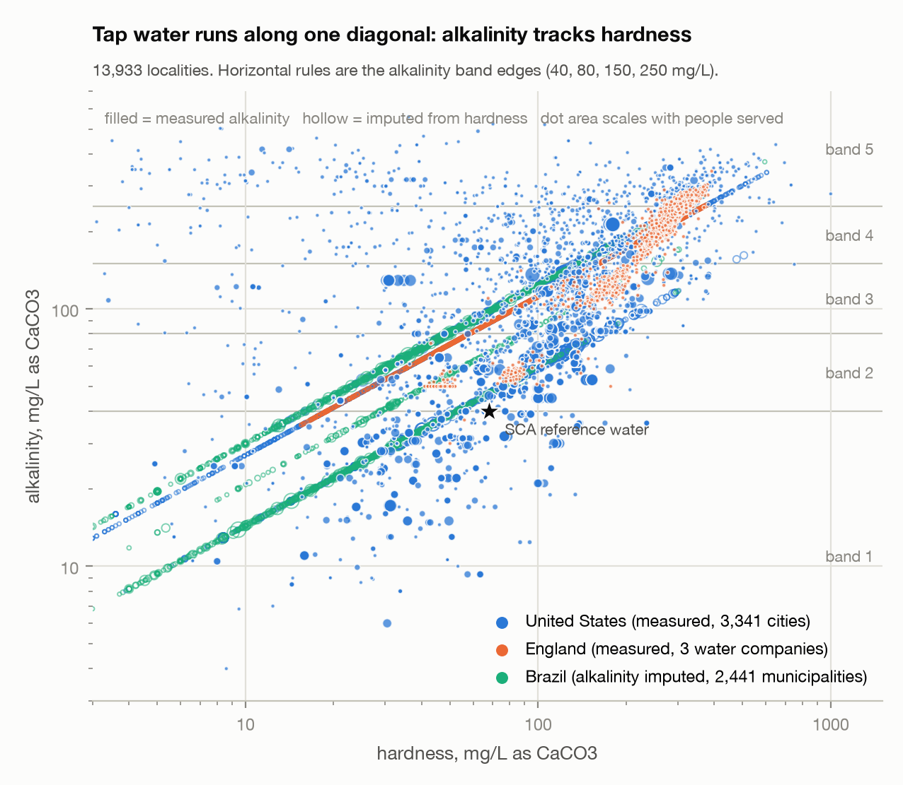
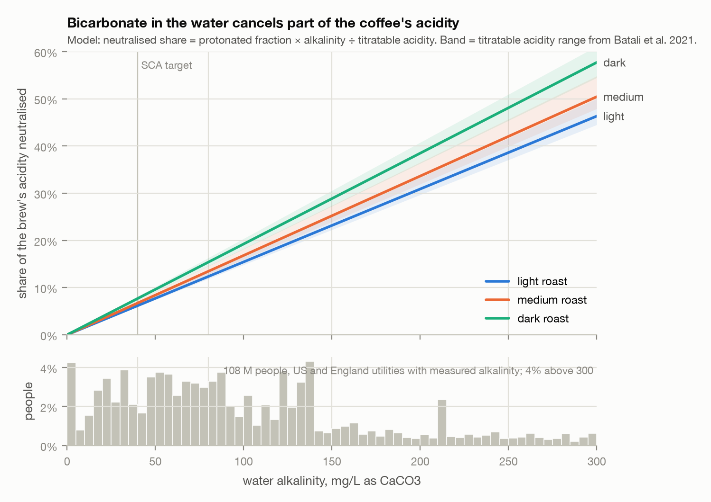

## Introduction

Municipal tap water varies enormously across the world in hardness (calcium and magnesium), alkalinity (mostly bicarbonate) and pH. Published chemistry says how these variables change coffee extraction and flavour: bicarbonate neutralises the organic and chlorogenic acids that give coffee its brightness [@Yeager2023], and dissolved cations may change how much of some compounds is extracted [@Hendon2014; @Bratthall2024]. What has not been done is to combine the two at scale: to map the water people brew with, apply the chemistry, and say, for each place and roast level, what the water does to the cup and what a brewer can do about it.

This paper is a prediction paper. It builds the atlas, states the model, reports the predictions with their uncertainties, and publishes the protocol that would test them. It does not report new sensory experiments. The predictions are falsifiable and the data needed to falsify them are cheap to collect, which is the point of publishing them first.

Three questions organise the work.

1. **Where does tap water sit** in the alkalinity and hardness plane, weighted by the people who drink it, and can alkalinity be predicted where only hardness is reported?
2. **How much of a coffee's acidity does a given water remove**, by roast level, and for what share of the population does this matter?
3. **What does compensation cost**, in coffee dose, in bitterness, or in blended water?

## Data

### Sources

@tbl-sources lists the sources in atlas v0. Every row of the underlying measurement table carries the source file, its checksum, the download date, the licence, the original parameter name, value and unit, and the conversion factor applied, so any number can be traced back to the published record.



**Brazil.** The national drinking-water surveillance system SISAGUA publishes semestral control samples reported by suppliers [@SISAGUA]. Total hardness, sodium and pH are present; alkalinity, calcium and magnesium are not measured anywhere in the system. We loaded the 2023 to 2026 files (8.2 million rows) and kept 194,226 measurements of the three variables at treatment outlets, distribution systems and consumption points for 2,441 municipalities. Source type (surface or ground) comes from the intake registry.

**United States.** TapWaterData compiles utility-reported hardness for 16,561 cities from Consumer Confidence Reports, with a tier flag separating utility-measured values from county ambient estimates [@TapWaterData2026]; we use only the measured tiers (7,614 cities). The EPA Six-Year Review 4 compliance data give finished-water alkalinity and pH per public water system for 2012 to 2019 [@EPASYR4]. Joining the two on the utility identifier yields hardness and alkalinity for 3,341 cities served by 1,670 utilities. The Water Quality Portal was examined and rejected: its 1.3 million recent results are ambient surface and groundwater, with fewer than a dozen finished-water sites.

**England and Northern Ireland.** The water industry's open-data hub publishes tap-sample results per small area (Lower-layer Super Output Area, about 1,500 people) for every company in England and Wales [@Stream]. Only three companies report the chemistry we need: Wessex Water (alkalinity and hardness, labelled), Southern Water (calcium, magnesium, alkalinity, with an empty units column) and Yorkshire Water (hardness). Northern Ireland Water publishes hardness, calcium, magnesium, sodium and pH per supply zone under the Open Government Licence. Every other company's alkalinity exists only in per-zone lookups under all-rights-reserved site terms; we did not use those values.

**Bottled water.** We compiled the label compositions of 187 supermarket bottled waters sold in Brazil, the United States, the United Kingdom, Germany, France, Italy and Portugal from brand websites and official label images, with one source URL per product; 182 have official provenance. Alkalinity is bicarbonate times 0.820 where bicarbonate is printed.

### Units and the hardness trap

All hardness and alkalinity values are stored in mg/L as CaCO~3~, all ions in mg/L of the ion, with conversion factors derived from molar masses. Three sources report "total hardness" in mg/L that turns out to be mg/L as calcium, not as CaCO~3~, a factor of 2.5 apart: Northern Ireland Water (the zone report's CaCO~3~ column equals the CSV figure times 2.4985), Southern Water (the hardness column tracks the calcium column 1:1, and the company's web checker labels its default unit "Cal mg/l") and SES Water. Wherever calcium and magnesium are both reported we derive hardness from them and ignore the reported hardness column. Every value whose unit basis had to be assumed carries a flag.

### Population weighting

Counting localities overstates the alkalinity people drink, because thousands of small groundwater systems each count once. We attach population to every locality: people served for US utilities, mid-2024 estimates for English small areas, the 2022 census for Brazilian municipalities. The per-locality median alkalinity of US and English finished water is 187 mg/L; the population-weighted median is 83 mg/L. All results below are population-weighted unless stated.

### Alkalinity where none is measured

Brazil has no alkalinity data at all. Across 5,658 US and English localities with both variables, log alkalinity against log hardness and source type fits with R^2^ 0.48 and a residual standard deviation of 0.52 on the log scale, a multiplicative error band of 1.7 in each direction. We apply this fit to Brazil's 2,441 municipalities and flag every imputed value; Brazil therefore enters the population statistics with a stated, wide, error band, and we report every headline number with and without it.

## Model

### Residual acidity

Bicarbonate in brewing water is protonated by coffee acids. At brew pH 4.9 to 5.1, 94 to 96 percent of bicarbonate has accepted a proton (carbonic acid pK~a1~ 6.35), so the neutralisation is close to one milliequivalent of acid per milliequivalent of alkalinity. We define the residual acidity of a brew in meq/L as

$$
\mathrm{residual} = \mathrm{TA}_\mathrm{intrinsic}(\mathrm{roast}, \mathrm{TDS}) - f(\mathrm{pH}) \cdot \frac{\mathrm{alkalinity}}{50.04},
$$

where TA is titratable acidity to pH 8.2, alkalinity is in mg/L as CaCO~3~, and $f$ is the protonated fraction of bicarbonate at the brew pH. The share of a coffee's acidity that a water removes is the second term divided by the first.

### Parameters

Titratable acidity by roast comes from the only drip-coffee dataset that measures it across brew strength and extraction [@Batali2021]: 258 brews of one washed Honduran Arabica at three roast levels, three strengths (1.0, 1.25, 1.5 percent total dissolved solids) and three extraction yields (16, 20, 24 percent). TA is linear in strength and nearly flat in extraction. @tbl-params gives the values. Because that study's brew water carried 32 mg/L alkalinity (computed from the printed mineral recipe), the measured TA has already lost about 0.6 meq/L to bicarbonate; the model adds it back before subtracting the target water's alkalinity.



### The cation term

Hendon and colleagues predicted from binding energies that magnesium and calcium increase the extraction of coffee acids [@Hendon2014]; a GC-MS and NMR study found no such effect on organic acids at 100 mg/L [@Bratthall2024]; and a recent three-water filter-brewing study found that dark roast brewed in the hardest water was rated more acidic by a recognition panel, which the authors attribute to calcium-assisted extraction [@Liu2025]. No study gives an extraction magnitude usable as a parameter. We carry a multiplicative extraction term on TA with a central value of zero and an upper bound of a 5 percent yield increase per meq/L of divalent cations, and report results at both. The Liu result means the upper bound must be taken seriously for dark roasts.

### Bands and the matching rule

We classify water into five alkalinity bands with round edges at 40, 80, 150 and 250 mg/L as CaCO~3~. A Gaussian-mixture clustering was also run and found no natural clusters: tap water forms a continuum along the alkalinity–hardness diagonal, and the model selection criterion kept falling up to the six-component cap. Fixed bands are as defensible and far easier to communicate.

For each band and roast we compute residual acidity at the band's population-weighted median water relative to the Specialty Coffee Association's reference water (40 mg/L alkalinity, 68 mg/L hardness [@SCAwater]). A ratio of 0.75 to 1.25 is labelled *works*, 0.5 to 0.75 *compensate*, below 0.5 *fights*.

### Sensory model and dial-in rules

The trained-panel study behind the TA data also reports marginal mean intensities of 32 attributes at each level of roast, strength and extraction [@Frost2020]. The design is balanced, so an additive model reproduces the marginal means exactly; interactions are not published, and the same group's response surface for sourness is a first-order plane [@Batali2021], so we use main effects only. Sourness rises 21 points per percent of strength and falls 0.83 points per percent of extraction; bitterness rises 23 points per percent of strength.

Two calibrations connect water to perception. Batali and colleagues' roast means give 3.61 sourness points per meq/L of TA. Dividing a water's neutralised acid by the TA-per-strength slope gives the strength increase that restores the acid balance (the chemistry estimate); dividing the predicted sourness loss by the sensory sourness-per-strength slope gives the increase that restores the sensory prediction (the sensory estimate). The two differ by a factor of 1.8 and we report both as a range. A third route is dilution: alkalinity is linear in mixing, so a share $1 - 40/\mathrm{alk}$ of zero-alkalinity water brings any tap water to the reference.

## Results

### Where tap water sits

@fig-where shows the 13,933 localities with both variables. Alkalinity tracks hardness along one diagonal in every country, with England's chalk south at the top and the imputed Brazilian municipalities forming straight lines by construction. A small softened-water regime, alkalinity kept and hardness stripped, sits above the diagonal and covers about one percent of people.

{#fig-where}

### How much acidity the water removes

@fig-neutral shows the model. At the SCA target the water removes 6 percent of a light roast's acidity and 8 percent of a dark roast's. At the population-weighted median US water (83 mg/L) the shares are 13 and 16 percent; at the population-weighted upper quartile (136 mg/L) 21 and 26 percent. For 20 percent of people the water removes more than a quarter of a light roast's acidity, for 31 percent more than a quarter of a dark roast's. Dark roast loses the largest share in every water because it starts with the least acid to lose, but it also has the least brightness at stake.

{#fig-neutral}

### Who brews with which water

@tbl-bands and @fig-bands give the bands. Bands one to three, up to 150 mg/L, hold about 90 percent of people and the SCA target sits at the edge of the first. The two bands above 150 mg/L hold about 10 percent of people overall but half of the English population in our three companies, all of them in the chalk south.



{#fig-bands}

### Matching table

@tbl-matching applies the rule. Every roast *works* in bands one to three at their medians and at their edges. Every roast needs *compensation* in bands four and five; in band four the ratio runs from 0.73 for light roast to 0.66 for dark roast, in band five from 0.62 to 0.53. Between-roast differences within a band are smaller than the difference between bands, which is why the advice is about the water first and the roast second.



### Dial-in rules

@fig-rules and @tbl-rules translate the model into recipe changes. Each 50 mg/L of alkalinity above the target removes about 1 meq/L of acid and 3.6 sourness points. Up to about 100 mg/L this is recoverable with 5 to 10 percent more coffee per 40 mg/L above target, at the price of 1 to 2 bitterness points. At 150 mg/L the strength route needs 16 to 29 percent more coffee and costs 4.5 bitterness points; at 250 mg/L, 31 to 55 percent and 8.5 points. Lowering extraction to regain sourness would need 9 points of yield at 150 mg/L, far outside the 2 to 4 points a grind change gives, so extraction is a weak lever on its own. Above 150 mg/L, blending with zero-alkalinity water (73 percent at 150 mg/L, 84 percent at 250 mg/L) or choosing a low-alkalinity bottled water is the cheaper move.



{#fig-rules}

### Bottled water

@fig-bottled and @tbl-bottled place 142 bottled waters with a printed bicarbonate or alkalinity on the same scale. They span the full tap-water range. Seventeen are near-zero-alkalinity diluents, mostly purified US brands; 32 brew like the reference water and are the natural control for a validation protocol because the same bottle is the same everywhere; 42, many of them European natural mineral waters, are as flat as hard tap water.



{#fig-bottled}

## Discussion

**What is new.** The atlas is the first open, provenance-tracked compilation of finished tap-water alkalinity and hardness across countries at the scale of tens of thousands of localities, weighted by people. The diagonal in @fig-where is itself a finding: hardness, which almost every utility reports, predicts alkalinity within a factor of 1.7, so the far larger hardness-only datasets are usable for coffee with a stated error. The matching table and dial-in rules are, to our knowledge, the first to be derived from published measurements rather than practitioner experience, with every constant traceable to a table in a paper.

**What is not validated.** No brew in this paper was tasted. The titratable acidity comes from one coffee in one laboratory; roast is defined by development time, not colour. The sensory slopes are marginal means from the same study. The two ways of sizing the strength compensation disagree by a factor of 1.8, and the truth may lie outside their range. Bicarbonate neutralisation is treated as stoichiometric; no controlled measurement of brew acidity against water alkalinity at fixed coffee exists in the literature we could read, including the two studies that varied water and roast [@Liu2025; @Kang2022].

**The dark-roast question.** Liu and colleagues' dark roast tasted more acidic in the hardest of three waters [@Liu2025], the opposite sign to buffering. Their waters differed by only 20 mg/L in alkalinity but 48 mg/L in hardness, and they measured relative chromatographic peak areas rather than titratable acidity, with a water supplier as co-author and funder. If the effect is real, the cation term is not secondary for dark roasts and our band-four and band-five predictions for dark roast are too pessimistic. This is the single most valuable target for a field test.

**Coverage and bias.** The atlas covers countries with open data, not the world. England is represented by three companies, two of them on chalk. Brazil's alkalinity is imputed from a US and English relationship. Softened and home-filtered water is invisible to utility data. All population-weighted statistics are dominated by the US, and the per-locality statistics by small groundwater systems; we report both.

**Licensing.** Most English alkalinity sits behind company web lookups whose terms reserve all rights. We used none of those values. A version of this atlas with permission from the companies, or from a UK institution with database rights, would roughly triple English coverage.

## Validation protocol {#sec-protocol}

The predictions are testable at home. One session is three cups of the same coffee, same recipe, same day: tap water; a reference-like bottled water from @tbl-bottled (alkalinity 25 to 60 mg/L); and tap water with the dose raised by the rule in @tbl-rules. A helper serves the cups blind. The taster answers, per pair, which cup is more sour, which more bitter, which they prefer. The session records city and utility (alkalinity from the atlas), roast level from the bag, filter or softener use, and optionally a photograph of an aquarium alkalinity test strip. The analysis is a mixed-effects logistic model of "tap cup is sourer" against predicted acid loss with roast as a fixed effect and taster as a random effect; the cup with the raised dose against the reference tests the compensation rule. With paired forced choices, about 150 sessions across the bands give 80 percent power to detect the predicted 20-percentage-point shift between the low and high bands. The protocol, form and analysis code are in the repository; the plan will be registered before the first submission.

## Data and code availability

The atlas, the measurement table with per-row provenance, the bottled-water table, all model code, the figure and table generators and this manuscript are in the project repository, under MIT for code and CC BY 4.0 for produced data. Upstream sources keep their own licences and are listed with checksums. Raw downloads (about 2.3 GB) are attached as release assets.

## Acknowledgements

The author used an AI assistant (Anthropic's Claude) for data engineering, literature retrieval, modelling and drafting under his direction; all decisions, interpretations and errors are the author's. Access to paywalled articles was through the CAPES Portal de Periódicos via the Universidade Federal do Paraná. No funding was received.

## References {.unnumbered}

::: {#refs}
:::
